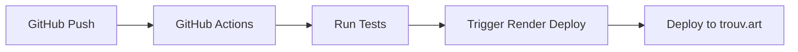

# 🌐 trouv.art 도메인 설정 가이드

## 📋 필요한 작업

### 1. DNS 설정 (도메인 등록업체에서 설정)

#### A 레코드 설정
```
Type: A
Name: @
Value: 216.24.57.1
TTL: 300
```

#### CNAME 레코드 설정 (www 서브도메인)
```
Type: CNAME
Name: www
Value: art-recommendation-saas.onrender.com
TTL: 300
```

### 2. Render 대시보드 설정

1. [Render Dashboard](https://dashboard.render.com) 로그인
2. `art-recommendation-saas` 서비스 선택
3. Settings → Custom Domains 섹션
4. "Add Custom Domain" 클릭
5. 다음 도메인 추가:
   - `trouv.art`
   - `www.trouv.art`

### 3. SSL 인증서 (자동)

Render가 Let's Encrypt를 통해 자동으로 SSL 인증서를 발급합니다.
- 도메인 추가 후 몇 분 내에 자동 활성화
- HTTPS 자동 적용

### 4. GitHub Secrets 설정 (자동 배포용)

GitHub 저장소 → Settings → Secrets and variables → Actions에서 추가:

- `RENDER_API_KEY`: Render API 키
- `RENDER_SERVICE_ID`: 서비스 ID

#### Render API 키 얻기:
1. Render Dashboard → Account Settings
2. API Keys 섹션
3. "Create API Key" 클릭

#### Service ID 얻기:
1. Render Dashboard에서 서비스 클릭
2. URL에서 ID 확인: `https://dashboard.render.com/web/srv-[SERVICE_ID]`

## 🚀 자동 배포 플로우



## ✅ 확인 사항

### DNS 전파 확인
```bash
# DNS 조회
nslookup trouv.art
dig trouv.art

# HTTP 응답 확인
curl -I https://trouv.art
```

### 배포 상태 확인
- Render Dashboard에서 실시간 로그 확인
- GitHub Actions 탭에서 워크플로우 상태 확인

## 🔧 트러블슈팅

### DNS가 작동하지 않는 경우
- DNS 전파에 최대 48시간 소요 가능
- CloudFlare DNS (1.1.1.1)로 테스트

### SSL 인증서 문제
- Render Dashboard → Custom Domains에서 상태 확인
- "Issuing certificate" 상태면 몇 분 대기

### 배포가 실패하는 경우
- GitHub Actions 로그 확인
- Render Dashboard 로그 확인
- 환경 변수 설정 확인

## 📞 지원

- Render 지원: https://render.com/docs
- GitHub Actions: https://docs.github.com/en/actions

---
*Last updated: 2025-08-19*