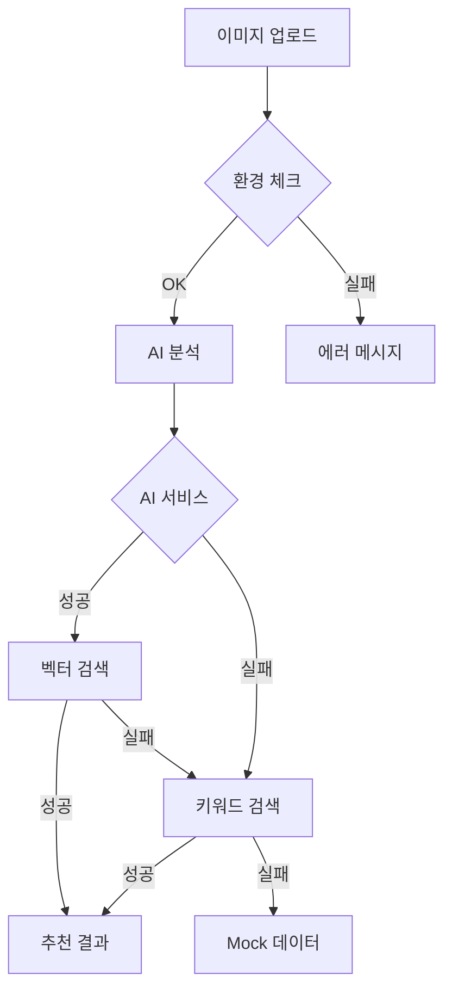

# 🎨 AI Art Recommendation SaaS - 프로젝트 요약

## 📌 프로젝트 개요

**AI Art Recommendation SaaS**는 4개의 AI 모델(Google Vision, Replicate CLIP, Clarifai, Local CLIP)을 앙상블로 활용하여 사용자가 업로드한 이미지를 분석하고 유사한 예술 작품을 추천하는 서비스입니다.

### 핵심 특징
- 🤖 **멀티 AI 앙상블**: 4개 AI 서비스 병렬 처리 및 가중평균
- 🎯 **벡터 유사도 검색**: PostgreSQL pgvector 활용
- 🚀 **고성능 서버**: Bun.serve() 기반
- 🛡️ **강력한 에러 핸들링**: 서비스 장애 시에도 안정적 작동

## 🏗️ 기술 스택

### Frontend
- **Bun + React + TypeScript**
- **Tailwind CSS** (반응형 디자인)
- **Error Boundary** (안정성)

### Backend  
- **Bun.serve()** (Express 대체)
- **TypeScript**
- **WebSocket** (실시간 통신)

### Database
- **Supabase** (PostgreSQL + Auth + Storage)
- **pgvector** (벡터 검색)

### AI Services
1. **Google Vision AI** (25%): 객체, 색상, 구성
2. **Replicate CLIP** (30%): 의미적 이해, 스타일
3. **Clarifai** (25%): 예술적 스타일, 분위기
4. **Local CLIP** (20%): 커스텀 아트 분석

## 🔧 주요 개선 사항

### 1. **에러 핸들링 강화**
```typescript
// Lazy initialization으로 서버 시작 실패 방지
let aiService: AIAnalysisService | null = null;
function getAIService(): AIAnalysisService {
  if (!aiService) {
    aiService = new AIAnalysisService();
  }
  return aiService;
}
```

### 2. **환경 변수 검증**
```bash
# 개발 시작 전 환경 체크
bun run dev  # 환경 검증 후 시작
bun run dev:unsafe  # 검증 없이 시작
bun run env:check  # 환경만 체크
```

### 3. **React Error Boundary**
- 컴포넌트 에러 시 앱 전체 중단 방지
- 사용자 친화적 에러 화면 제공

### 4. **Fallback 시스템**
- Supabase 미설정 시 → Mock 데이터 반환
- AI 서비스 실패 시 → 다른 서비스로 대체
- 이미지 로드 실패 시 → 플레이스홀더 표시

## 📁 프로젝트 구조

```
art-recommendation-saas/
├── frontend/
│   ├── index.html
│   ├── app.tsx (메인 React 앱)
│   └── components/
│       └── ErrorBoundary.tsx
├── backend/
│   ├── index.ts (Bun 서버)
│   ├── routes/
│   │   └── static.ts (정적 파일 서빙)
│   ├── services/
│   │   ├── supabase.ts
│   │   └── ai-analysis.ts
│   └── utils/
│       └── env-validator.ts
├── ai-service/
│   ├── integrations/
│   │   ├── google-vision.ts
│   │   ├── replicate.ts
│   │   ├── clarifai.ts
│   │   └── local-clip.ts
│   └── utils/
│       └── ensemble.ts
└── shared/
    └── types/
        └── index.ts
```

## 🚀 시작하기

### 1. 환경 설정
```bash
# .env 파일 생성
cp .env.example .env

# 필수 설정
SUPABASE_URL=your-url
SUPABASE_ANON_KEY=your-key

# 선택 설정 (최소 1개 권장)
GOOGLE_CLOUD_PROJECT_ID=your-project
REPLICATE_API_TOKEN=your-token
CLARIFAI_API_KEY=your-key
```

### 2. 의존성 설치
```bash
bun install
```

### 3. 개발 서버 실행
```bash
bun run dev
```

## 📊 API 엔드포인트

### 기본 서비스
| 엔드포인트 | 메서드 | 설명 |
|-----------|--------|------|
| `/` | GET | React 프론트엔드 |
| `/api/health` | GET | 서비스 상태 확인 |
| `/api/ai/test` | GET | AI 서비스 테스트 |
| `/api/artworks` | GET | 작품 목록 조회 |

### 인증 관련
| 엔드포인트 | 메서드 | 설명 |
|-----------|--------|------|
| `/api/auth/signup` | POST | 회원가입 |
| `/api/auth/signin` | POST | 로그인 |
| `/api/auth/signout` | POST | 로그아웃 |
| `/api/auth/user` | GET | 현재 사용자 정보 |
| `/api/auth/profile` | PUT | 프로필 업데이트 |
| `/api/auth/upload-limit` | GET | 업로드 제한 확인 |

### 이미지 & 분석
| 엔드포인트 | 메서드 | 설명 |
|-----------|--------|------|
| `/api/upload` | POST | 이미지 업로드 |
| `/api/analyze` | POST | 이미지 분석 및 추천 |
| `/api/uploads` | GET | 사용자 업로드 히스토리 |

### 추천 관련
| 엔드포인트 | 메서드 | 설명 |
|-----------|--------|------|
| `/api/recommendations` | GET | 추천 히스토리 조회 |
| `/api/recommendations/click` | POST | 추천 클릭 기록 |

### 결제 & 구독
| 엔드포인트 | 메서드 | 설명 |
|-----------|--------|------|
| `/api/subscription/plans` | GET | 구독 요금제 조회 |
| `/api/subscription/create` | POST | 구독 생성 |
| `/api/subscription/cancel` | POST | 구독 취소 |
| `/api/subscription/resume` | POST | 구독 재개 |
| `/api/subscription/status` | GET | 구독 상태 조회 |
| `/api/subscription/portal` | POST | 결제 포털 세션 생성 |
| `/api/webhook/stripe` | POST | Stripe 웹훅 처리 |

### 관리자 기능
| 엔드포인트 | 메서드 | 설명 |
|-----------|--------|------|
| `/api/admin/stats/users` | GET | 사용자 통계 |
| `/api/admin/stats/usage` | GET | 사용량 통계 |
| `/api/admin/activity` | GET | 최근 활동 조회 |
| `/api/admin/artworks` | GET/POST | 작품 목록/추가 |
| `/api/admin/artworks/:id` | PUT/DELETE | 작품 수정/삭제 |

### 분석 & 모니터링
| 엔드포인트 | 메서드 | 설명 |
|-----------|--------|------|
| `/api/analytics/user` | GET | 사용자 사용량 분석 |
| `/api/analytics/system` | GET | 시스템 사용량 분석 |
| `/api/analytics/recommendations` | GET | 추천 효과성 분석 |

### 구매 대행 서비스
| 엔드포인트 | 메서드 | 설명 |
|-----------|--------|------|
| `/api/purchase/request` | POST | 구매 요청 생성 |
| `/api/purchase/requests` | GET | 사용자 구매 요청 목록 |
| `/api/purchase/requests/:id/cancel` | POST | 구매 요청 취소 |
| `/api/admin/purchase/requests` | GET | 전체 구매 요청 (관리자) |
| `/api/admin/purchase/requests/:id/status` | PUT | 구매 요청 상태 변경 |

## 🔍 에러 처리 흐름



## 💡 주요 학습 포인트

1. **Bun의 장점**
   - 빠른 시작 속도
   - 내장 TypeScript 지원
   - HTML import 지원

2. **에러 처리 중요성**
   - 서비스별 독립적 실패 처리
   - 사용자 경험 우선
   - 명확한 에러 메시지

3. **환경 변수 관리**
   - 개발/운영 분리
   - 필수/선택 구분
   - 시작 전 검증

## 🎯 완료된 기능 (Week 2)

### ✅ 사용자 인증 시스템
- **회원가입/로그인**: 이메일/비밀번호 기반 인증
- **프로필 관리**: 닉네임, 아바타 설정
- **세션 관리**: 자동 로그인 상태 유지
- **업로드 제한**: 무료 10회/일, 프리미엄 100회/일

### ✅ 이미지 업로드 & 저장
- **Supabase Storage**: 안전한 클라우드 저장소
- **파일 검증**: 타입/크기 제한 (10MB)
- **업로드 기록**: 사용자별 이미지 히스토리
- **드래그 앤 드롭**: 직관적인 업로드 UI

### ✅ 사용자별 추천 히스토리
- **분석 결과 저장**: AI 키워드, 임베딩
- **추천 기록**: 유사도, 클릭 추적
- **취향 그룹**: 개인화된 추천 엔진
- **통계 데이터**: 일일 사용량 모니터링

### ✅ 향상된 프론트엔드
- **반응형 디자인**: 모바일 최적화
- **게스트 모드**: 로그인 없이도 기본 기능 사용
- **사용자 프로필 메뉴**: 업로드 현황, 히스토리
- **에러 핸들링**: 친화적인 오류 메시지

## 🎯 완료된 기능 (Week 3)

### ✅ Stripe 결제 시스템
- **구독 플랜**: 무료 (10회/일) vs 프리미엄 (100회/일, ₩9,900/월)
- **결제 처리**: Stripe API 완전 통합
- **구독 관리**: 업그레이드, 취소, 재개 기능
- **결제 포털**: Stripe Customer Portal 연동
- **웹훅 처리**: 자동 구독 상태 동기화

### ✅ 관리자 대시보드
- **사용자 통계**: 총 사용자, 프리미엄 사용자, 오늘 가입자
- **사용량 분석**: 일일/월간 분석 수, 클릭률 통계
- **실시간 모니터링**: 최근 가입자, 업로드 활동
- **작품 관리**: CRUD 작업, 활성화/비활성화
- **권한 관리**: 환경변수 기반 관리자 인증

### ✅ 작품 관리 시스템
- **작품 CRUD**: 생성, 조회, 수정, 삭제
- **이미지 관리**: URL 기반 이미지 저장
- **키워드 시스템**: AI 추천 향상을 위한 태깅
- **가격 관리**: 작품별 가격 설정
- **상태 관리**: 활성/비활성 상태 토글

### ✅ 사용량 분석 & 모니터링
- **개인 사용량**: 일일/월별 분석 횟수 추적
- **시스템 통계**: 전체 서비스 사용 패턴 분석
- **추천 효과성**: 클릭률, 유사도 점수 분석
- **결제 연동**: 월별 사용량 기반 과금 준비
- **실시간 대시보드**: 관리자용 종합 모니터링

### ✅ 이메일 알림 시스템
- **환영 이메일**: 회원가입 시 자동 발송
- **구독 알림**: 프리미엄 시작/취소 통지
- **결제 알림**: 결제 실패 시 안내 메일
- **사용량 경고**: 80% 도달 시 알림
- **HTML 템플릿**: 반응형 이메일 디자인

## 🎯 완료된 기능 (Week 4)

### ✅ React Native 모바일 앱
- **크로스 플랫폼**: iOS/Android 지원 (Expo 기반)
- **네이티브 UI**: React Native Paper 디자인 시스템
- **카메라 통합**: 실시간 촬영 + 갤러리 선택
- **오프라인 지원**: 로컬 스토리지 및 캐싱
- **성능 최적화**: 이미지 레이지 로딩, 메모리 관리

### ✅ 모바일 인증 & 상태관리
- **Supabase 통합**: 완전한 모바일 인증 시스템
- **Context API**: 전역 상태 관리
- **자동 로그인**: 토큰 기반 세션 유지
- **사용량 추적**: 실시간 업로드 제한 모니터링
- **에러 핸들링**: 친화적인 오류 메시지

### ✅ 모바일 AI 분석 시스템
- **실시간 분석**: 모바일에서 서버로 이미지 전송
- **결과 시각화**: 키워드, 유사도, 추천 이유 표시
- **추천 상호작용**: 클릭 추적 및 피드백
- **히스토리 관리**: 개인별 분석 기록 저장
- **오프라인 모드**: 네트워크 오류 시 대응

### ✅ 구매 대행 서비스
- **완전한 워크플로우**: 요청 → 처리 → 완료
- **고객 관리**: 연락처, 배송지, 특별 요청 사항
- **상태 추적**: 5단계 구매 진행 상태
- **관리자 도구**: 웹 기반 구매 요청 관리 시스템
- **자동 알림**: 이메일 + 푸시 알림 연동

### ✅ 푸시 알림 시스템
- **Expo Notifications**: 크로스 플랫폼 푸시 알림
- **스마트 알림**: 분석 완료, 구매 상태 변경, 사용량 경고
- **개인화**: 사용자 설정에 따른 맞춤 알림
- **배지 관리**: iOS 앱 아이콘 배지 업데이트
- **딥링크**: 알림 탭 시 해당 화면으로 이동

### ✅ 모바일 배포 시스템
- **EAS Build**: Expo Application Services 통합
- **멀티 환경**: Development/Preview/Production 빌드
- **자동 빌드**: GitHub Actions 연동 가능
- **앱스토어 준비**: iOS App Store, Google Play Store 배포 준비
- **OTA 업데이트**: 코드 푸시를 통한 실시간 업데이트

### ✅ 구매 관리 대시보드
- **실시간 모니터링**: 모든 구매 요청 실시간 추적
- **상태 관리**: 드래그 앤 드롭 방식의 상태 변경
- **고객 소통**: 내장된 메시지 시스템
- **가격 협상**: 예상가격 → 최종가격 업데이트
- **성과 분석**: 구매 완료율, 고객 만족도 추적

## 🎯 완료된 기능 (Week 5)

### ✅ 다중 이미지 분석 시스템
- **티어별 가격**: 3장 무료, 4-10장 $5, 11장 이상 $10
- **공통 키워드 추출**: 여러 이미지 간 유사성 자동 분석
- **일회성 결제**: Stripe Checkout을 통한 간편 결제
- **Progressive 분석**: 이미지별 중간 결과 저장
- **결과 캐싱**: 24시간 동안 재분석 없이 결과 재사용

### ✅ 외부 플랫폼 통합
- **Artsy API**: 세계적인 미술품 플랫폼 검색
- **Behance API**: 디지털 아트 및 일러스트레이션 검색
- **Instagram/Pinterest**: 소셜 미디어 아트 검색 (준비 중)
- **출처 표시**: 모든 외부 작품에 원본 링크 제공
- **통합 검색**: 여러 플랫폼 동시 검색 및 결과 병합

### ✅ 향상된 추천 시스템
- **멀티소스 추천**: 내부 DB + 외부 플랫폼 통합
- **인기도 기반 정렬**: 좋아요, 조회수 기반 랭킹
- **실시간 업데이트**: 외부 플랫폼 최신 작품 반영
- **스마트 캐싱**: 자주 검색되는 결과 1시간 캐싱

## 🎯 다음 단계

1. **Week 6**: 소셜 기능, 커뮤니티 플랫폼
2. **Week 7**: 성능 최적화 및 배포 준비

## 📝 참고사항

- API 키 없이도 Mock 데이터로 기본 작동
- 최소 1개 AI 서비스만 있어도 추천 가능
- 모든 에러는 graceful하게 처리됨

---

**Built with ❤️ using Bun, React, Supabase, and AI**